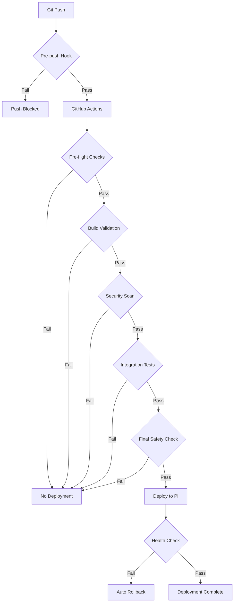

# 🛡️ Safe Deployment System Guide

## Overview

This repository now has a **multi-layer safety system** that ensures bad code NEVER reaches the production Pi. The system validates code at every stage:

1. **Pre-commit** - Before code is committed locally
2. **Pre-push** - Before code leaves your machine
3. **GitHub Actions** - Before deployment is attempted
4. **Self-hosted runner** - Only deploys validated code

## 🚀 Quick Start

### Initial Setup (One Time)

```bash
# Run the setup script
chmod +x setup-safe-deployment.sh
./setup-safe-deployment.sh
```

This installs:
- Git hooks for pre-commit and pre-push validation
- Required validation tools (TruffleHog, golangci-lint, etc.)
- Manual validation scripts

## 🔒 Protection Layers

### Layer 1: Pre-Commit Hooks
**When:** Before code is committed locally
**What it checks:**
- Code formatting
- Basic syntax validation
- Import sorting
- File size limits

### Layer 2: Pre-Push Hooks
**When:** Before pushing to GitHub
**What it checks:**
- ❌ **Secrets and credentials** - Blocks exposed secrets
- ❌ **Hardcoded values** - No IPs, passwords, or keys
- ✅ **Go syntax and build** - Must compile successfully
- ✅ **Python syntax** - All Python files must be valid
- ✅ **TypeScript build** - Frontend must build
- ✅ **Docker compose** - All compose files must be valid
- ✅ **Audio quality** - Preserves audio handling
- ✅ **Docker build** - Container must build successfully

### Layer 3: GitHub Actions Validation
**When:** After push, before deployment
**What it checks:**

#### Phase 1: Pre-flight Checks (GitHub-hosted)
- Secret scanning with TruffleHog and Gitleaks
- Configuration file validation
- Syntax error detection for all languages
- Validation score calculation (must be >80/100)

#### Phase 2: Build Validation (GitHub-hosted)
- Go tests with race detection
- Code coverage requirements (100%)
- Linting with golangci-lint
- Docker build test
- Container security scanning

#### Phase 3: Security Validation (GitHub-hosted)
- Dependency vulnerability scanning
- SAST (Static Application Security Testing)
- High-severity issue detection

#### Phase 4: Integration Testing (GitHub-hosted)
- Service health checks
- MinIO connectivity
- API endpoint testing

#### Phase 5: Final Safety Check (GitHub-hosted)
- Compiles all validation results
- Makes final deployment decision
- Sends pre-deployment notification

### Layer 4: Deployment to Pi
**When:** Only after ALL validations pass
**What happens:**
- Creates backup before deployment
- Builds and deploys new version
- Runs health checks
- Automatic rollback on failure
- Post-deployment verification

## 📋 Validation Commands

### Test Before Pushing
```bash
# Run all validations manually
./validate-deployment.sh
```

### Normal Development Flow
```bash
# Make changes
git add .
git commit -m "feat: new feature"  # Pre-commit hooks run here
git push                            # Pre-push hooks run here
# GitHub Actions automatically validates and deploys if safe
```

### Emergency Bypass (USE WITH EXTREME CAUTION!)
```bash
# Only when absolutely necessary
./emergency-deploy.sh
```

## 🎯 What This Prevents

### ❌ **Cannot Deploy:**
- Code with exposed secrets or credentials
- Code that doesn't compile or build
- Code with syntax errors
- Code with critical security vulnerabilities
- Code that fails tests
- Code with invalid configurations
- Code that degrades audio quality

### ✅ **Only Deploys:**
- Code that passes ALL security checks
- Code that builds successfully
- Code that passes all tests
- Code with valid configurations
- Code that preserves audio quality
- Code that has been fully validated

## 🔧 Workflow Configuration

### Key GitHub Secrets Required
```yaml
# Pi Connection
PI_HOST: 192.168.1.127
PI_USER: gaius
PI_SSH_KEY: <private key>
PI_PORT: 22

# MinIO Configuration
MINIO_ENDPOINT: localhost:9000
MINIO_ACCESS_KEY: gaius
MINIO_SECRET_KEY: <secret>
MINIO_BUCKET: sermons

# Discord Notifications
DISCORD_WEBHOOK_URL: <webhook url>

# Application Settings
PORT: 8000
WAV_SUFFIX: _raw
AAC_SUFFIX: _streamable
BATCH_THRESHOLD: 2
```

### Workflow Files
- **`.github/workflows/deploy-production-safe.yml`** - Main safe deployment workflow
- **`.githooks/pre-push`** - Pre-push validation hook
- **`.pre-commit-config.yaml`** - Pre-commit hooks configuration

## 🚨 Troubleshooting

### Validation Fails Locally
```bash
# See what's failing
./validate-deployment.sh

# Fix the specific issue reported
# Then try again
```

### Push Blocked
```bash
# The pre-push hook will tell you exactly what failed
# Fix the issue and try again
git push
```

### Deployment Fails in GitHub Actions
1. Check the Actions tab in GitHub
2. Click on the failed workflow
3. Each phase shows what failed
4. Fix the issue and push again

### Need to Deploy Despite Failures
```bash
# EMERGENCY ONLY - This bypasses safety checks
./emergency-deploy.sh
# You'll need to type 'DEPLOY ANYWAY' to confirm
```

## 📊 Monitoring Deployment Status

### GitHub Actions
- Go to Actions tab in GitHub repository
- Watch the "Safe Production Deployment" workflow
- Green checkmarks = validation passed
- Red X = validation failed (code won't deploy)

### Discord Notifications
You'll receive notifications for:
- 🚀 Deployment approved (all checks passed)
- ✅ Deployment successful
- ❌ Deployment failed (with rollback)
- 🏥 Post-deployment health status

## 🔄 How Deployment Works



## 🎉 Benefits

1. **Zero bad deployments** - Multiple validation layers prevent issues
2. **Fast feedback** - Know immediately if code has issues
3. **Automatic rollback** - Failed deployments auto-recover
4. **Clear error messages** - Know exactly what to fix
5. **Security first** - No secrets or vulnerabilities can deploy
6. **Audio quality preserved** - Special checks for audio handling
7. **Self-documenting** - Workflow shows what's validated

## 📚 Related Documentation

- [Pre-commit hooks documentation](.pre-commit-config.yaml)
- [GitHub Actions workflow](.github/workflows/deploy-production-safe.yml)
- [Emergency procedures](emergency-deploy.sh)
- [Manual validation](validate-deployment.sh)

---

**Remember:** This system is designed to protect production. If validations are failing, there's usually a good reason. Fix the underlying issue rather than bypassing the checks.