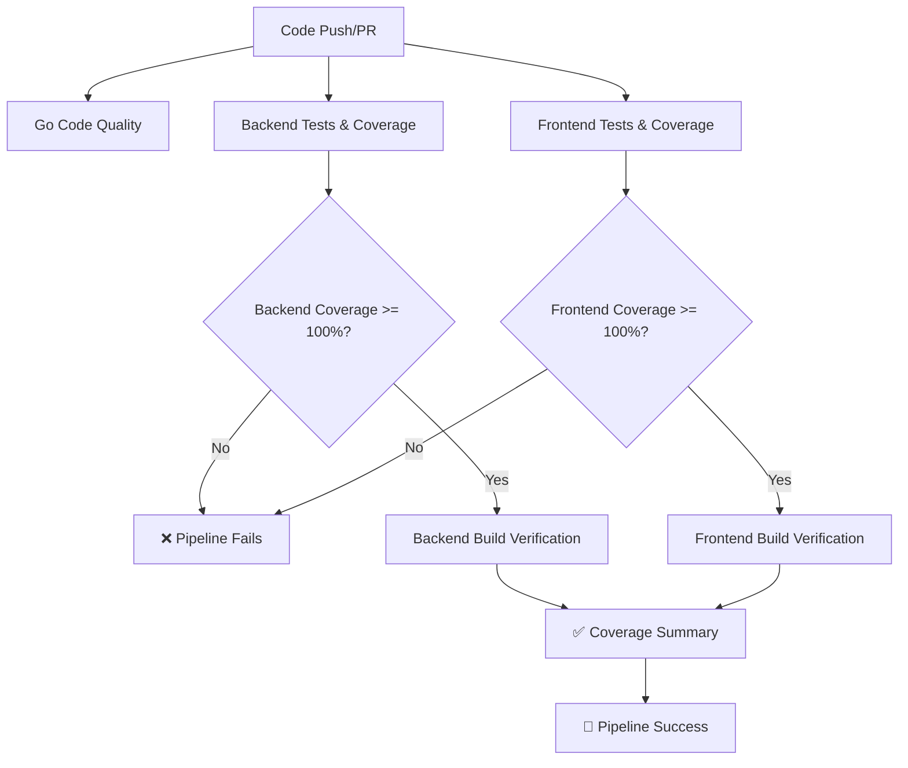

# CI/CD Pipeline - 100% Coverage Enforcement

This directory contains GitHub Actions workflows that enforce strict quality standards including **mandatory 100% test coverage** for both backend and frontend code.

## 🎯 Coverage Requirements

- **Backend (Go):** 100% coverage required
- **Frontend (TypeScript/React):** 100% coverage required
- **Build Failure:** Any coverage below 100% will fail the CI pipeline

## 📋 Workflows Overview

### 1. `main-ci.yml` - Primary CI Pipeline
**Purpose:** Comprehensive testing and coverage enforcement

**Features:**
- ✅ 100% coverage enforcement for Go backend
- ✅ 100% coverage enforcement for React/TypeScript frontend
- ✅ Cross-platform build verification (Ubuntu, macOS)
- ✅ Detailed coverage reporting with HTML artifacts
- ✅ Codecov integration for coverage tracking
- ✅ Clear pass/fail indicators in pipeline output

**Triggered by:**
- Push to `main`, `master`, `develop`
- Pull requests to `main`, `master`, `develop`

### 2. `go-lint.yml` - Code Quality & Security
**Purpose:** Code quality, linting, and security scanning

**Features:**
- ✅ Comprehensive linting with `golangci-lint`
- ✅ Security vulnerability scanning with `gosec`
- ✅ Dependency vulnerability checks
- ✅ Performance benchmarking
- ✅ Code formatting verification

**Triggered by:**
- Changes to Go files in backend/
- Changes to Go modules or lint configuration

## 🚀 Pipeline Flow



## 📊 Coverage Reports

### Backend Coverage (Go)
- **Tool:** `go test` with `-coverprofile`
- **Format:** HTML, JSON, Text
- **Threshold:** Exactly 100%
- **Location:** `backend/coverage.out`, `backend/coverage.html`

### Frontend Coverage (TypeScript/React)
- **Tool:** Vitest with V8 coverage
- **Format:** HTML, JSON, LCOV, Text  
- **Threshold:** 100% on branches, functions, lines, statements
- **Location:** `frontend/coverage/`

## 🔧 Local Development

### Running Coverage Locally

**Backend:**
```bash
cd backend
./coverage.sh                    # Run with threshold check
go test -coverprofile=coverage.out ./...
go tool cover -html=coverage.out # View HTML report
```

**Frontend:**
```bash
cd frontend
npm run test:coverage           # Run with threshold enforcement
npm run test:coverage -- --ui   # Interactive coverage UI
```

## 📈 Coverage Enforcement Details

### Backend (Go)
- Uses `go tool cover` to calculate exact coverage percentage
- Floating-point comparison ensures precision
- Fails immediately if any file has < 100% coverage
- Provides detailed uncovered code listings

### Frontend (React/TypeScript)
- Vitest automatically enforces thresholds via configuration
- `failOnCoverageThreshold: true` ensures build failure
- `all: true` includes all files, not just tested ones
- Separate thresholds for branches, functions, lines, statements

## ⚠️ Important Notes

### For Developers
1. **100% coverage is mandatory** - no exceptions
2. Add tests BEFORE pushing code to avoid CI failures
3. Use local coverage tools to verify before pushing
4. Focus on edge cases and error paths for complete coverage

### Coverage Best Practices
- Test both success and failure scenarios
- Cover all conditional branches
- Test error handling paths
- Verify edge cases and boundary conditions
- Mock external dependencies appropriately

### Troubleshooting Coverage Issues
1. **Uncovered Lines:** Check `go tool cover -func=coverage.out`
2. **Missing Tests:** Use `go test -coverprofile=coverage.out -v ./...`
3. **Frontend Issues:** Run `npm run test:coverage -- --reporter=verbose`
4. **Build Context:** Coverage runs in CI use same environment as local

## 🏆 Benefits

- **Quality Assurance:** Every line of code is tested
- **Regression Prevention:** Changes can't break untested code
- **Documentation:** Tests serve as living documentation
- **Confidence:** Deploy with certainty that code works
- **Maintenance:** Easier refactoring with comprehensive test coverage

## 🚨 Pipeline Failure Scenarios

The CI pipeline will fail if:
- Backend coverage < 100%
- Frontend coverage < 100%
- Any test fails
- Build fails on any platform
- Security vulnerabilities detected
- Code quality issues found
- Dependencies have known vulnerabilities

## 📞 Support

For questions about coverage requirements or CI/CD pipeline:
1. Check the coverage reports in pipeline artifacts
2. Review uncovered code sections highlighted in output
3. Ensure all edge cases and error paths are tested
4. Verify mock configurations are comprehensive