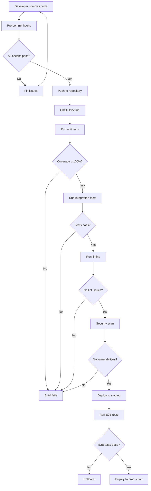

# Test-Driven Development (TDD) Comprehensive Guide

## Sermon Uploader Enterprise TDD Strategy

### Table of Contents
1. [TDD Fundamentals](#tdd-fundamentals)
2. [Red-Green-Refactor Cycle](#red-green-refactor-cycle)
3. [Testing Strategy](#testing-strategy)
4. [Test Coverage Requirements](#test-coverage-requirements)
5. [Developer Onboarding](#developer-onboarding)
6. [Testing Patterns & Best Practices](#testing-patterns--best-practices)
7. [CI/CD Integration](#cicd-integration)
8. [Troubleshooting Guide](#troubleshooting-guide)
9. [Examples & Templates](#examples--templates)
10. [Quality Gates & Deployment](#quality-gates--deployment)

---

## TDD Fundamentals

Test-Driven Development (TDD) is a software development methodology where tests are written before the actual code implementation. This approach ensures that all code is thoroughly tested and meets the specified requirements from the very beginning.

### Core Principles

1. **Write tests first**: Every feature starts with a failing test
2. **Minimal implementation**: Write only enough code to make tests pass
3. **Continuous refactoring**: Improve code structure without changing behavior
4. **100% test coverage**: Every line of code must be covered by tests
5. **Fast feedback**: Tests should run quickly and provide immediate feedback

### Benefits

- **Higher code quality**: Bugs are caught early in development
- **Better design**: Writing tests first leads to more modular, testable code
- **Documentation**: Tests serve as living documentation of system behavior
- **Confidence in refactoring**: Comprehensive tests enable safe code changes
- **Reduced debugging time**: Issues are identified immediately

---

## Red-Green-Refactor Cycle

The TDD cycle consists of three distinct phases that must be followed rigorously:

### 🔴 Red Phase: Write a Failing Test

**Objective**: Write a test that captures the desired behavior but currently fails.

```bash
# Run tests to see the failure
go test ./... -v
```

**Key Points**:
- Test should fail for the right reason (not due to compilation errors)
- Keep tests focused on a single behavior
- Use descriptive test names that explain the expected behavior
- Start with the simplest test case

**Example**:
```go
func TestFileService_CheckDuplicate_ShouldReturnTrue_WhenFileExists(t *testing.T) {
    // Arrange
    service := &FileService{}
    filename := "existing_file.wav"
    
    // Act
    isDuplicate, err := service.CheckDuplicate(filename)
    
    // Assert
    assert.NoError(t, err)
    assert.True(t, isDuplicate, "Should detect duplicate file")
}
```

### 🟢 Green Phase: Make the Test Pass

**Objective**: Write the minimal amount of code needed to make the test pass.

```bash
# Implement the feature
# Run tests to verify they pass
go test ./... -v
```

**Key Points**:
- Focus on making tests pass, not on perfect implementation
- Avoid over-engineering at this stage
- Use the simplest solution that works
- Don't worry about code duplication yet

**Example**:
```go
func (s *FileService) CheckDuplicate(filename string) (bool, error) {
    // Minimal implementation to pass the test
    if filename == "existing_file.wav" {
        return true, nil
    }
    return false, nil
}
```

### 🔵 Refactor Phase: Improve Code Quality

**Objective**: Clean up the code while maintaining all tests passing.

```bash
# Refactor code
# Run tests continuously to ensure no regression
go test ./... -v
```

**Key Points**:
- Eliminate code duplication
- Improve naming and structure
- Extract reusable components
- Optimize performance if needed
- All tests must continue to pass

**Example**:
```go
func (s *FileService) CheckDuplicate(filename string) (bool, error) {
    // Proper implementation after refactoring
    exists, err := s.minioClient.StatObject(context.Background(), s.bucketName, filename, minio.StatObjectOptions{})
    if err != nil {
        if minio.ToErrorResponse(err).Code == "NoSuchKey" {
            return false, nil
        }
        return false, err
    }
    return exists.Size > 0, nil
}
```

### Cycle Timing

- **Red Phase**: 2-5 minutes
- **Green Phase**: 5-15 minutes
- **Refactor Phase**: 5-30 minutes
- **Total Cycle**: 15-50 minutes maximum

---

## Testing Strategy

### Test Pyramid Structure

```
        🔺 E2E Tests (5%)
       /              \
      /   Integration   \
     /    Tests (25%)    \
    /____________________\
   /                      \
  /    Unit Tests (70%)    \
 /________________________\
```

### 1. Unit Tests (70% of total tests)

**Purpose**: Test individual functions, methods, and classes in isolation.

**Characteristics**:
- Fast execution (< 1ms per test)
- No external dependencies
- Use mocks/stubs for dependencies
- High code coverage
- Easy to debug

**When to Write**:
- Every public function/method
- Critical business logic
- Error handling paths
- Edge cases and boundary conditions

**Example Structure**:
```go
func TestPresignedURL_Success_ShouldReturnURL(t *testing.T) {
    // Arrange
    mockMinio := &MockMinIOService{}
    mockConfig := &config.Config{}
    h := &TestHandlers{
        minioService: mockMinio,
        config:       mockConfig,
    }
    
    // Mock expectations
    mockMinio.On("CheckDuplicateByFilename", "test.wav").Return(false, nil)
    mockMinio.On("GeneratePresignedUploadURL", "test.wav", mock.AnythingOfType("time.Duration")).Return("http://mocked-success-url", nil)
    
    // Act
    err := h.GetPresignedURL(ctx)
    
    // Assert
    assert.NoError(t, err)
    assert.Equal(t, 200, ctx.Response().StatusCode())
    mockMinio.AssertExpectations(t)
}
```

### 2. Integration Tests (25% of total tests)

**Purpose**: Test interaction between multiple components or systems.

**Characteristics**:
- Medium execution time (100ms - 5s per test)
- Test component interactions
- May use real databases/services in test mode
- Focus on data flow and integration points

**When to Write**:
- API endpoint testing
- Database integration
- External service integration
- File system operations

**Example**:
```go
// +build integration

func TestEndToEndUpload_ShouldUploadFileSuccessfully(t *testing.T) {
    // Setup test environment
    testEnv := setupIntegrationTest(t)
    defer testEnv.cleanup()
    
    // Test actual file upload through the entire pipeline
    filename := "integration_test.wav"
    fileSize := int64(1024 * 1024) // 1MB
    
    // Get presigned URL
    presignedURL, err := testEnv.fileService.GeneratePresignedUploadURL(filename, time.Hour)
    assert.NoError(t, err)
    
    // Upload file
    err = uploadTestFile(presignedURL, createTestWAVFile(fileSize))
    assert.NoError(t, err)
    
    // Verify file exists in MinIO
    exists, err := testEnv.minioClient.StatObject(context.Background(), "sermons", filename, minio.StatObjectOptions{})
    assert.NoError(t, err)
    assert.Equal(t, fileSize, exists.Size)
}
```

### 3. End-to-End Tests (5% of total tests)

**Purpose**: Test complete user workflows from start to finish.

**Characteristics**:
- Slow execution (5s - 60s per test)
- Test entire application stack
- Use real services and databases
- Simulate user behavior

**When to Write**:
- Critical user journeys
- System-level functionality
- Regression prevention for major features

### Performance Tests

**Purpose**: Validate system performance under load.

**Characteristics**:
- Benchmark critical operations
- Test concurrent usage
- Memory and CPU profiling
- Load testing scenarios

**Example**:
```go
func BenchmarkPresignedURLGeneration(b *testing.B) {
    service := setupBenchmarkService()
    filename := "benchmark_test.wav"
    
    b.ResetTimer()
    for i := 0; i < b.N; i++ {
        _, err := service.GeneratePresignedUploadURL(filename, time.Hour)
        if err != nil {
            b.Fatal(err)
        }
    }
}
```

---

## Test Coverage Requirements

### Coverage Standards

- **Minimum Coverage**: 100% line coverage (enforced)
- **Branch Coverage**: 100% (all conditional paths tested)
- **Function Coverage**: 100% (all functions tested)
- **Integration Coverage**: All public APIs tested

### Coverage Tools

```bash
# Generate coverage report
./coverage.sh

# View detailed coverage
go tool cover -html=coverage.out -o coverage.html
open coverage.html

# Check coverage threshold
go tool cover -func=coverage.out | grep "total:"
```

### Coverage Enforcement

The project uses automated coverage checking with a **100% threshold**:

```bash
#!/bin/bash
# coverage.sh - Enforces 100% test coverage

set -e

echo "🧪 Running Go tests with coverage collection..."

# Run tests with coverage
go test -race -coverprofile=coverage.out -covermode=atomic ./...

# Generate text coverage report
echo "📊 Generating coverage report..."
go tool cover -func=coverage.out > coverage.txt

# Extract total coverage percentage
COVERAGE=$(go tool cover -func=coverage.out | grep "total:" | awk '{print $3}' | sed 's/%//')
THRESHOLD=100.0

echo "🎯 Coverage Threshold: ${THRESHOLD}%"
echo "📊 Actual Coverage: ${COVERAGE}%"

# Check if coverage meets threshold
if awk "BEGIN {exit !($COVERAGE >= $THRESHOLD)}"; then
    echo "✅ SUCCESS: Coverage ${COVERAGE}% meets the required ${THRESHOLD}% threshold!"
    echo "🎉 All code is properly tested!"
else
    echo "❌ FAILURE: Coverage ${COVERAGE}% is below the required ${THRESHOLD}% threshold!"
    echo "🔍 Files with less than 100% coverage:"
    go tool cover -func=coverage.out | grep -v "100.0%" | grep -v "total:" || true
    exit 1
fi
```

### Achieving 100% Coverage

**1. Test All Code Paths**
```go
func ProcessFile(filename string) error {
    if filename == "" {
        return errors.New("filename cannot be empty") // Test this path
    }
    
    if strings.HasSuffix(filename, ".wav") {
        return processWAVFile(filename) // Test this path
    }
    
    return processOtherFile(filename) // Test this path
}

// Tests needed:
// - TestProcessFile_EmptyFilename_ShouldReturnError
// - TestProcessFile_WAVFile_ShouldCallProcessWAVFile
// - TestProcessFile_OtherFile_ShouldCallProcessOtherFile
```

**2. Test Error Conditions**
```go
func TestFileService_CheckDuplicate_MinIOError_ShouldReturnError(t *testing.T) {
    mockMinio := &MockMinIOService{}
    service := &FileService{minioService: mockMinio}
    
    // Mock MinIO error
    mockMinio.On("StatObject", mock.Anything).Return(nil, errors.New("MinIO error"))
    
    _, err := service.CheckDuplicate("test.wav")
    
    assert.Error(t, err)
    assert.Contains(t, err.Error(), "MinIO error")
}
```

**3. Use Table-Driven Tests for Multiple Scenarios**
```go
func TestValidateFilename(t *testing.T) {
    tests := []struct {
        name     string
        filename string
        wantErr  bool
        errMsg   string
    }{
        {"valid wav file", "test.wav", false, ""},
        {"valid mp3 file", "test.mp3", false, ""},
        {"empty filename", "", true, "filename cannot be empty"},
        {"invalid extension", "test.txt", true, "unsupported file type"},
        {"no extension", "test", true, "file must have extension"},
    }
    
    for _, tt := range tests {
        t.Run(tt.name, func(t *testing.T) {
            err := ValidateFilename(tt.filename)
            if tt.wantErr {
                assert.Error(t, err)
                assert.Contains(t, err.Error(), tt.errMsg)
            } else {
                assert.NoError(t, err)
            }
        })
    }
}
```

---

## Developer Onboarding

### Quick Start Guide

**Day 1: Setup and First Test**

1. **Install Dependencies**
```bash
# Go installation
go version  # Should be 1.23+

# Test runner
go test ./... -v

# Coverage tool
./coverage.sh
```

2. **Understand Project Structure**
```
sermon-uploader/backend/
├── handlers/           # HTTP request handlers
│   ├── presigned.go   # Implementation
│   └── presigned_test.go  # Tests
├── services/          # Business logic services
│   ├── file_service.go
│   └── file_service_test.go
├── config/            # Configuration management
├── scripts/           # Build and test scripts
└── coverage.sh        # Coverage verification
```

3. **Write Your First Test**
```go
// Add to handlers/example_test.go
func TestMyFirstFunction(t *testing.T) {
    // Red: Write failing test
    result := MyFirstFunction("input")
    assert.Equal(t, "expected", result)
}

// Implement function in handlers/example.go
func MyFirstFunction(input string) string {
    return "expected"  // Green: Make it pass
}
```

**Day 2-3: TDD Practice**

1. **Practice Red-Green-Refactor**
   - Pick a simple feature from backlog
   - Write test first (Red)
   - Implement minimal solution (Green)
   - Improve code quality (Refactor)

2. **Learn Testing Patterns**
   - Study existing test files
   - Understand mock usage
   - Practice table-driven tests

**Week 1: Production Ready**

1. **Complete Feature with TDD**
2. **Achieve 100% Coverage**
3. **Submit Code Review**

### Learning Resources

**Required Reading**:
1. [Go Testing Package](https://pkg.go.dev/testing)
2. [Testify Documentation](https://github.com/stretchr/testify)
3. [Clean Code Testing Principles](https://blog.cleancoder.com/uncle-bob/2017/05/05/TestDefinitions.html)

**Practice Exercises**:
1. Implement duplicate detection with TDD
2. Add new file validation rules
3. Create integration test for upload pipeline

### Mentoring Process

**Week 1-2: Pair Programming**
- Senior developer guides TDD process
- Focus on test-first mindset
- Learn project-specific patterns

**Week 3-4: Code Review Focus**
- Independent development with review
- Emphasis on test quality
- Coverage validation

**Month 2: Advanced Topics**
- Performance testing
- Integration test patterns
- CI/CD pipeline understanding

---

## Testing Patterns & Best Practices

### Go-Specific Testing Patterns

#### 1. Table-Driven Tests

**Best Practice**: Use table-driven tests for multiple scenarios with similar logic.

```go
func TestPresignedURL_ValidationScenarios(t *testing.T) {
    tests := []struct {
        name       string
        filename   string
        fileSize   int64
        setupMock  func(*MockMinIOService)
        wantStatus int
        wantError  bool
    }{
        {
            name:     "valid small file",
            filename: "small.wav",
            fileSize: 1024,
            setupMock: func(m *MockMinIOService) {
                m.On("CheckDuplicateByFilename", "small.wav").Return(false, nil)
                m.On("GeneratePresignedUploadURL", "small.wav", mock.AnythingOfType("time.Duration")).Return("http://url", nil)
            },
            wantStatus: 200,
            wantError:  false,
        },
        {
            name:     "duplicate file",
            filename: "duplicate.wav", 
            fileSize: 1024,
            setupMock: func(m *MockMinIOService) {
                m.On("CheckDuplicateByFilename", "duplicate.wav").Return(true, nil)
            },
            wantStatus: 409,
            wantError:  true,
        },
        {
            name:     "minio error",
            filename: "error.wav",
            fileSize: 1024,
            setupMock: func(m *MockMinIOService) {
                m.On("CheckDuplicateByFilename", "error.wav").Return(false, errors.New("minio error"))
            },
            wantStatus: 500,
            wantError:  true,
        },
    }

    for _, tt := range tests {
        t.Run(tt.name, func(t *testing.T) {
            // Setup
            mockMinio := &MockMinIOService{}
            tt.setupMock(mockMinio)
            
            h := &TestHandlers{minioService: mockMinio}
            
            // Execute test logic...
            
            mockMinio.AssertExpectations(t)
        })
    }
}
```

#### 2. Dependency Injection for Testing

**Pattern**: Use interfaces to make code testable.

```go
// Production code
type FileService struct {
    minioClient MinIOClientInterface
    config      *config.Config
}

type MinIOClientInterface interface {
    StatObject(ctx context.Context, bucket, object string, opts minio.StatObjectOptions) (minio.ObjectInfo, error)
    PutObject(ctx context.Context, bucket, object string, reader io.Reader, size int64, opts minio.PutObjectOptions) (minio.UploadInfo, error)
}

// Test code
type MockMinIOClient struct {
    mock.Mock
}

func (m *MockMinIOClient) StatObject(ctx context.Context, bucket, object string, opts minio.StatObjectOptions) (minio.ObjectInfo, error) {
    args := m.Called(ctx, bucket, object, opts)
    return args.Get(0).(minio.ObjectInfo), args.Error(1)
}
```

#### 3. Test Helpers and Fixtures

**Pattern**: Create reusable test utilities.

```go
// Test helpers
func createTestFileService(t *testing.T) *FileService {
    mockMinio := &MockMinIOClient{}
    config := &config.Config{
        MinioBucket: "test-bucket",
        MinioEndpoint: "localhost:9000",
    }
    
    return &FileService{
        minioClient: mockMinio,
        config: config,
    }
}

func createTestWAVFile(size int64) []byte {
    // Generate test WAV file data
    data := make([]byte, size)
    // Add WAV header
    copy(data[0:4], []byte("RIFF"))
    // ... WAV format specifics
    return data
}

func setupIntegrationTest(t *testing.T) *testEnvironment {
    // Create test database
    // Setup test MinIO instance  
    // Configure test services
    return &testEnvironment{
        // ... test infrastructure
    }
}
```

#### 4. Context and Timeout Testing

**Pattern**: Test timeout and cancellation behavior.

```go
func TestFileUpload_ContextTimeout_ShouldFail(t *testing.T) {
    // Create context with short timeout
    ctx, cancel := context.WithTimeout(context.Background(), 1*time.Millisecond)
    defer cancel()
    
    service := createTestFileService(t)
    
    // This should fail due to timeout
    err := service.UploadFile(ctx, "test.wav", bytes.NewReader([]byte("data")))
    
    assert.Error(t, err)
    assert.Contains(t, err.Error(), "context deadline exceeded")
}
```

#### 5. Concurrent Testing

**Pattern**: Test race conditions and concurrent access.

```go
func TestConcurrentFileUploads(t *testing.T) {
    service := createTestFileService(t)
    const numGoroutines = 10
    
    var wg sync.WaitGroup
    errors := make(chan error, numGoroutines)
    
    for i := 0; i < numGoroutines; i++ {
        wg.Add(1)
        go func(id int) {
            defer wg.Done()
            
            filename := fmt.Sprintf("concurrent_test_%d.wav", id)
            err := service.UploadFile(context.Background(), filename, bytes.NewReader([]byte("data")))
            
            errors <- err
        }(i)
    }
    
    wg.Wait()
    close(errors)
    
    // Check all uploads succeeded
    for err := range errors {
        assert.NoError(t, err)
    }
}
```

### Testing Anti-Patterns to Avoid

#### ❌ Don't: Test Implementation Details
```go
// BAD - tests internal implementation
func TestFileService_InternalMethod(t *testing.T) {
    service := &FileService{}
    result := service.internalHelperMethod("input") // Testing private method
    assert.Equal(t, "expected", result)
}
```

#### ✅ Do: Test Public Behavior
```go
// GOOD - tests public behavior
func TestFileService_ProcessFile_ShouldValidateAndUpload(t *testing.T) {
    service := createTestFileService(t)
    
    err := service.ProcessFile("valid.wav", []byte("wav data"))
    
    assert.NoError(t, err)
    // Verify expected side effects through mocks
}
```

#### ❌ Don't: Write Fragile Tests
```go
// BAD - brittle test that breaks with refactoring
func TestPresignedURL_ResponseStructure(t *testing.T) {
    response := getPresignedURL("test.wav")
    
    // Too specific about response structure
    assert.Equal(t, "http://url", response["data"]["upload"]["presigned"]["url"])
}
```

#### ✅ Do: Write Robust Tests
```go
// GOOD - tests essential behavior
func TestPresignedURL_ShouldReturnValidUploadURL(t *testing.T) {
    response := getPresignedURL("test.wav")
    
    assert.True(t, response.Success)
    assert.NotEmpty(t, response.UploadURL)
    assert.True(t, strings.HasPrefix(response.UploadURL, "http"))
}
```

#### ❌ Don't: Test Multiple Things at Once
```go
// BAD - tests too many things
func TestFileService_ProcessAndValidateAndUploadAndNotify(t *testing.T) {
    // Tests validation, upload, notification, metadata storage all at once
}
```

#### ✅ Do: Focus on Single Behavior
```go
// GOOD - focused tests
func TestFileService_ValidateFile_ShouldRejectInvalidFormat(t *testing.T) { }
func TestFileService_UploadFile_ShouldStoreInMinIO(t *testing.T) { }
func TestFileService_NotifyUpload_ShouldSendDiscordMessage(t *testing.T) { }
```

---

## CI/CD Integration

### GitHub Actions Workflow

The project uses GitHub Actions for automated testing and deployment:

```yaml
# .github/workflows/test-and-deploy.yml
name: Test and Deploy

on:
  push:
    branches: [ main, develop ]
  pull_request:
    branches: [ main ]

jobs:
  test:
    runs-on: ubuntu-latest
    
    services:
      minio:
        image: minio/minio
        env:
          MINIO_ROOT_USER: testuser
          MINIO_ROOT_PASSWORD: testpass123
        ports:
          - 9000:9000
        options: >-
          --health-cmd "curl -f http://localhost:9000/minio/health/live"
          --health-interval 10s
          --health-timeout 5s
          --health-retries 5
    
    steps:
    - uses: actions/checkout@v3
    
    - name: Set up Go
      uses: actions/setup-go@v3
      with:
        go-version: 1.23
    
    - name: Install dependencies
      run: |
        go mod download
        go mod verify
    
    - name: Run unit tests
      run: |
        go test -race -coverprofile=coverage.out -covermode=atomic ./...
    
    - name: Check coverage threshold
      run: |
        ./coverage.sh
    
    - name: Run integration tests
      run: |
        ./scripts/run-integration-tests.sh --ci
      env:
        MINIO_ENDPOINT: localhost:9000
        MINIO_ACCESS_KEY: testuser
        MINIO_SECRET_KEY: testpass123
    
    - name: Upload coverage to Codecov
      uses: codecov/codecov-action@v3
      with:
        file: ./coverage.out

  lint:
    runs-on: ubuntu-latest
    steps:
    - uses: actions/checkout@v3
    
    - name: Set up Go
      uses: actions/setup-go@v3
      with:
        go-version: 1.23
    
    - name: Run golangci-lint
      uses: golangci/golangci-lint-action@v3
      with:
        version: latest
        args: --config .golangci.yml

  security:
    runs-on: ubuntu-latest
    steps:
    - uses: actions/checkout@v3
    
    - name: Run Gosec Security Scanner
      uses: securecodewarrior/github-action-gosec@master
      with:
        args: './...'
```

### Pre-commit Hooks

The project enforces quality gates through pre-commit hooks:

```bash
#!/bin/bash
# .githooks/pre-commit

set -e

echo "🔍 Running pre-commit checks..."

# Check Go formatting
echo "📐 Checking Go formatting..."
UNFORMATTED=$(gofmt -l .)
if [ -n "$UNFORMATTED" ]; then
    echo "❌ Go files need formatting:"
    echo "$UNFORMATTED"
    echo "Run: gofmt -w ."
    exit 1
fi

# Run Go vet
echo "🔎 Running go vet..."
go vet ./... || {
    echo "❌ Go vet found issues"
    exit 1
}

# Run tests with coverage
echo "🧪 Running tests with coverage..."
go test -race -coverprofile=coverage.out -covermode=atomic ./... || {
    echo "❌ Tests failed"
    exit 1
}

# Check coverage threshold
./coverage.sh || {
    echo "❌ Coverage threshold not met"
    exit 1
}

# Run linter
echo "🔍 Running golangci-lint..."
if command -v golangci-lint &> /dev/null; then
    golangci-lint run --config .golangci.yml || {
        echo "❌ Linting issues found"
        exit 1
    }
fi

echo "🎉 All pre-commit checks passed!"
```

### Coverage Reporting

Coverage is tracked and reported automatically:

```bash
# Generate coverage report
go test -coverprofile=coverage.out ./...

# Generate HTML coverage report
go tool cover -html=coverage.out -o coverage.html

# Extract coverage percentage
COVERAGE=$(go tool cover -func=coverage.out | grep "total:" | awk '{print $3}' | sed 's/%//')

# Enforce 100% coverage threshold
if ! awk "BEGIN {exit !($COVERAGE >= 100.0)}"; then
    echo "❌ Coverage $COVERAGE% below required 100%"
    exit 1
fi
```

### Integration Test Environment

Integration tests run in controlled environments:

```bash
# Local integration testing
./scripts/run-integration-tests.sh --fast

# CI integration testing with containers
./scripts/run-integration-tests.sh --ci

# Performance testing
./scripts/run-integration-tests.sh --performance
```

---

## Troubleshooting Guide

### Common Testing Issues

#### 1. Test Failures

**Issue**: Tests pass locally but fail in CI
```bash
# Common causes and solutions:

# Race conditions
go test -race ./...  # Enable race detection

# Environment differences
export MINIO_ENDPOINT=localhost:9000  # Set proper endpoints

# Timing issues
time.Sleep(100 * time.Millisecond)  # Add small delays for async operations

# Resource cleanup
defer cleanup()  # Always clean up resources
```

**Solution Pattern**:
```go
func TestWithProperCleanup(t *testing.T) {
    // Setup
    resource := setupTestResource(t)
    defer func() {
        if err := resource.Cleanup(); err != nil {
            t.Logf("Cleanup error: %v", err)
        }
    }()
    
    // Test logic
    // ...
}
```

#### 2. Mock Issues

**Issue**: Mock expectations not met
```go
// Problem: Mock not configured properly
mockService := &MockService{}
// Missing: mockService.On("Method", args).Return(result)

// Solution: Always set up mock expectations
mockService.On("CheckDuplicate", "test.wav").Return(false, nil)
defer mockService.AssertExpectations(t)
```

**Debug Mocks**:
```go
func TestWithMockDebugging(t *testing.T) {
    mockService := &MockService{}
    
    // Enable mock call logging
    mockService.Test(t)
    
    // Set up expectations with specific arguments
    mockService.On("Method", 
        mock.MatchedBy(func(arg string) bool {
            t.Logf("Mock called with: %s", arg)
            return arg == "expected"
        }),
    ).Return("result", nil)
    
    // ... test logic
    
    // This will show what calls were made vs expected
    mockService.AssertExpectations(t)
}
```

#### 3. Integration Test Issues

**Issue**: MinIO connection failures
```bash
# Check MinIO is running
curl -f http://localhost:9000/minio/health/live

# Check credentials
export MINIO_ACCESS_KEY=gaius
export MINIO_SECRET_KEY="John 3:16"

# Use containerized MinIO for tests
docker run -d -p 9000:9000 -e MINIO_ROOT_USER=testuser -e MINIO_ROOT_PASSWORD=testpass123 minio/minio server /data
```

**Solution**:
```go
func setupIntegrationTest(t *testing.T) *testEnv {
    // Check if MinIO is available
    client, err := minio.New("localhost:9000", &minio.Options{
        Creds:  credentials.NewStaticV4("testuser", "testpass123", ""),
        Secure: false,
    })
    if err != nil {
        t.Skip("MinIO not available for integration tests")
    }
    
    // Test connection
    ctx, cancel := context.WithTimeout(context.Background(), 5*time.Second)
    defer cancel()
    
    _, err = client.ListBuckets(ctx)
    if err != nil {
        t.Skipf("Cannot connect to MinIO: %v", err)
    }
    
    return &testEnv{minioClient: client}
}
```

#### 4. Coverage Issues

**Issue**: Coverage below 100%
```bash
# Find uncovered code
go tool cover -func=coverage.out | grep -v "100.0%"

# Generate HTML report for visual inspection
go tool cover -html=coverage.out -o coverage.html
open coverage.html
```

**Common uncovered patterns**:
```go
// Error handling not tested
if err != nil {
    return err  // Make sure to test error paths
}

// Default case not tested
switch value {
case "a":
    return "A"
case "b": 
    return "B"
default:
    return "Unknown"  // Test this path
}

// Init functions
func init() {
    // These need integration tests or build tags
}
```

#### 5. Performance Test Issues

**Issue**: Inconsistent benchmark results
```bash
# Run benchmarks multiple times
go test -bench=. -benchtime=10s -count=5

# Profile memory usage
go test -bench=. -benchmem -memprofile=mem.prof

# Profile CPU usage
go test -bench=. -cpuprofile=cpu.prof
```

### Debugging Strategies

#### 1. Test Isolation
```go
func TestIsolated(t *testing.T) {
    // Each test should be completely independent
    originalEnv := os.Getenv("IMPORTANT_VAR")
    defer os.Setenv("IMPORTANT_VAR", originalEnv)
    
    os.Setenv("IMPORTANT_VAR", "test_value")
    
    // Test logic that depends on environment
}
```

#### 2. Logging and Debugging
```go
func TestWithDebugging(t *testing.T) {
    // Enable debug logging
    if testing.Verbose() {
        log.SetLevel(log.DebugLevel)
    }
    
    // Log test progress
    t.Log("Starting test phase 1")
    
    // Use testify's require for immediate failure
    require.NoError(t, err, "Setup should not fail")
    
    // Log important values
    t.Logf("Generated URL: %s", url)
}
```

#### 3. Test Data Management
```go
func TestWithCleanData(t *testing.T) {
    // Use unique test data to avoid conflicts
    testID := uuid.New().String()
    testFilename := fmt.Sprintf("test_%s.wav", testID)
    
    // Clean up after test
    defer func() {
        cleanupTestFile(testFilename)
    }()
    
    // Test logic
}
```

---

## Examples & Templates

### Unit Test Template

```go
package handlers

import (
    "testing"
    "github.com/stretchr/testify/assert"
    "github.com/stretchr/testify/mock"
)

// Test template for handlers
func TestHandlerName_Scenario_ExpectedOutcome(t *testing.T) {
    // Arrange
    mockService := &MockService{}
    handler := &Handler{service: mockService}
    
    // Set up mock expectations
    mockService.On("Method", "input").Return("output", nil)
    
    // Prepare test input
    input := createTestInput()
    
    // Act
    result, err := handler.HandleRequest(input)
    
    // Assert
    assert.NoError(t, err)
    assert.Equal(t, expectedResult, result)
    
    // Verify mock expectations
    mockService.AssertExpectations(t)
}
```

### Integration Test Template

```go
// +build integration

package integration

import (
    "context"
    "testing"
    "time"
    
    "github.com/stretchr/testify/assert"
    "github.com/stretchr/testify/require"
)

func TestIntegration_EndToEnd_ShouldSucceed(t *testing.T) {
    // Setup integration environment
    env := setupIntegrationTest(t)
    defer env.cleanup()
    
    // Test complete workflow
    ctx := context.Background()
    
    // Step 1: Setup
    testData := createTestData(t)
    
    // Step 2: Execute
    result, err := env.service.ProcessWorkflow(ctx, testData)
    require.NoError(t, err)
    
    // Step 3: Verify results
    assert.NotNil(t, result)
    
    // Step 4: Verify side effects
    exists, err := env.storage.FileExists(ctx, testData.Filename)
    assert.NoError(t, err)
    assert.True(t, exists)
}
```

### Benchmark Test Template

```go
func BenchmarkOperation(b *testing.B) {
    // Setup
    service := setupBenchmarkService()
    testData := createBenchmarkData()
    
    b.ResetTimer()
    b.ReportAllocs()
    
    for i := 0; i < b.N; i++ {
        _, err := service.Operation(testData)
        if err != nil {
            b.Fatal(err)
        }
    }
}

func BenchmarkConcurrentOperation(b *testing.B) {
    service := setupBenchmarkService()
    
    b.RunParallel(func(pb *testing.PB) {
        testData := createBenchmarkData()
        for pb.Next() {
            service.Operation(testData)
        }
    })
}
```

### Table-Driven Test Template

```go
func TestValidation_MultipleScenarios(t *testing.T) {
    tests := []struct {
        name        string
        input       string
        expected    bool
        expectError bool
        errorMsg    string
    }{
        {
            name:        "valid input",
            input:       "valid.wav",
            expected:    true,
            expectError: false,
        },
        {
            name:        "empty input",
            input:       "",
            expected:    false,
            expectError: true,
            errorMsg:    "input cannot be empty",
        },
        {
            name:        "invalid format",
            input:       "invalid.txt",
            expected:    false,
            expectError: true,
            errorMsg:    "unsupported format",
        },
    }

    for _, tt := range tests {
        t.Run(tt.name, func(t *testing.T) {
            result, err := ValidateInput(tt.input)
            
            if tt.expectError {
                assert.Error(t, err)
                if tt.errorMsg != "" {
                    assert.Contains(t, err.Error(), tt.errorMsg)
                }
            } else {
                assert.NoError(t, err)
                assert.Equal(t, tt.expected, result)
            }
        })
    }
}
```

### Mock Interface Template

```go
// Generate mocks with mockery or manual implementation

//go:generate mockery --name=ServiceInterface --output=mocks

type ServiceInterface interface {
    ProcessFile(filename string) error
    ValidateFile(filename string) (bool, error)
    UploadFile(filename string, data []byte) error
}

// Manual mock implementation
type MockService struct {
    mock.Mock
}

func (m *MockService) ProcessFile(filename string) error {
    args := m.Called(filename)
    return args.Error(0)
}

func (m *MockService) ValidateFile(filename string) (bool, error) {
    args := m.Called(filename)
    return args.Bool(0), args.Error(1)
}

func (m *MockService) UploadFile(filename string, data []byte) error {
    args := m.Called(filename, data)
    return args.Error(0)
}
```

### Test Helper Template

```go
// Test utilities and helpers
package testutil

import (
    "context"
    "testing"
    "time"
    
    "github.com/minio/minio-go/v7"
    "github.com/stretchr/testify/require"
)

type TestEnvironment struct {
    MinioClient *minio.Client
    Context     context.Context
    Cleanup     func()
}

func SetupIntegrationTest(t *testing.T) *TestEnvironment {
    ctx := context.Background()
    
    // Setup MinIO client
    client, err := minio.New("localhost:9000", &minio.Options{
        Creds:  credentials.NewStaticV4("testuser", "testpass123", ""),
        Secure: false,
    })
    require.NoError(t, err)
    
    // Create test bucket
    bucketName := fmt.Sprintf("test-bucket-%d", time.Now().UnixNano())
    err = client.MakeBucket(ctx, bucketName, minio.MakeBucketOptions{})
    require.NoError(t, err)
    
    cleanup := func() {
        // Remove all objects
        objectsCh := client.ListObjects(ctx, bucketName, minio.ListObjectsOptions{Recursive: true})
        for object := range objectsCh {
            client.RemoveObject(ctx, bucketName, object.Key, minio.RemoveObjectOptions{})
        }
        
        // Remove bucket
        client.RemoveBucket(ctx, bucketName)
    }
    
    return &TestEnvironment{
        MinioClient: client,
        Context:     ctx,
        Cleanup:     cleanup,
    }
}

func CreateTestWAVFile(size int64) []byte {
    data := make([]byte, size)
    
    // WAV header
    copy(data[0:4], []byte("RIFF"))
    // File size - 8
    binary.LittleEndian.PutUint32(data[4:8], uint32(size-8))
    copy(data[8:12], []byte("WAVE"))
    
    // Format chunk
    copy(data[12:16], []byte("fmt "))
    binary.LittleEndian.PutUint32(data[16:20], 16) // fmt chunk size
    binary.LittleEndian.PutUint16(data[20:22], 1)  // PCM format
    binary.LittleEndian.PutUint16(data[22:24], 2)  // stereo
    binary.LittleEndian.PutUint32(data[24:28], 44100) // sample rate
    
    return data
}
```

---

## Quality Gates & Deployment

### Pre-Deployment Checklist

**Code Quality Gates**:
- [ ] ✅ 100% test coverage achieved
- [ ] ✅ All tests passing (unit + integration + E2E)
- [ ] ✅ No linting issues (golangci-lint)
- [ ] ✅ No security vulnerabilities (gosec)
- [ ] ✅ Performance benchmarks within acceptable range
- [ ] ✅ Code review approved by senior developer

**Testing Requirements**:
- [ ] ✅ New features have corresponding tests
- [ ] ✅ Bug fixes include regression tests
- [ ] ✅ Integration tests cover API changes
- [ ] ✅ Performance tests validate non-functional requirements

### Relationship Between Testing, Linting, and Deployment



### Deployment Pipeline Configuration

**Stage 1: Development**
```bash
# Pre-commit validation
./scripts/pre-commit-tests.sh

# Local development testing
./scripts/run-integration-tests.sh --fast
```

**Stage 2: Continuous Integration**
```yaml
# GitHub Actions workflow
name: CI/CD Pipeline

on: [push, pull_request]

jobs:
  quality-gates:
    runs-on: ubuntu-latest
    steps:
    - name: Unit Tests + Coverage
      run: |
        go test -race -coverprofile=coverage.out ./...
        ./coverage.sh  # Enforces 100% coverage
    
    - name: Integration Tests
      run: ./scripts/run-integration-tests.sh --ci
    
    - name: Linting
      run: golangci-lint run --config .golangci.yml
    
    - name: Security Scan
      run: gosec ./...
    
    - name: Performance Tests
      run: ./scripts/run-integration-tests.sh --performance
```

**Stage 3: Deployment**
```bash
# Automated deployment only if all gates pass
if [[ "$CI_TESTS_PASSED" == "true" && "$COVERAGE" == "100.0" ]]; then
    echo "✅ All quality gates passed - deploying to production"
    deploy_to_production
else
    echo "❌ Quality gates failed - blocking deployment"
    exit 1
fi
```

### Monitoring and Alerting

**Post-Deployment Validation**:
```bash
# Health check tests run in production
./scripts/run-integration-tests.sh --health --production

# Monitor key metrics
curl -f https://api.example.com/health
curl -f https://api.example.com/metrics
```

**Production Testing Strategy**:
- Canary deployments with monitoring
- Feature flags for gradual rollout
- Automated rollback on health check failures
- Real-time alerting on test failures

### Metrics and KPIs

**Test Metrics Tracked**:
- Test coverage percentage (target: 100%)
- Test execution time (target: < 5 minutes for full suite)
- Test failure rate (target: < 1% flaky tests)
- Mean time to detect (MTTD) issues
- Mean time to resolve (MTTR) issues

**Quality Metrics**:
- Deployment frequency
- Lead time for changes
- Change failure rate
- Service recovery time

This comprehensive TDD guide ensures that the sermon uploader system maintains the highest quality standards while enabling rapid, confident development and deployment.