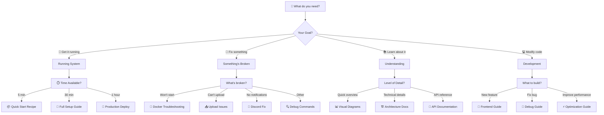

# 🧭 Visual Navigation Guide

> **Can't find what you need?** This interactive map will get you there in seconds!

## 🎯 Choose Your Path

## 🔍 Quick Decision Helper

### "I don't know where to start"
→ Go to **[🍰 Quick Start Recipe](recipes/quick-start.md)**

### "It was working but now it's not"
→ Go to **[⚡ Emergency Commands](quick-reference/commands.md#emergency-commands)**

### "I need to understand before I touch anything"
→ Go to **[📊 Visual System Overview](architecture/overview.md)**

### "I want to add a new feature"
→ Go to **[💻 Development Setup](development/setup/local-setup.md)**

### "I need to deploy this for real users"
→ Go to **[🚀 Production Deployment](architecture/deployment/cloudflare-tunnel.md)**

## 📍 Most Visited Pages

Based on what people usually need:

1. **[⚡ Commands Cheat Sheet](quick-reference/commands.md)** - #1 most used
2. **[🍰 5-Minute Quick Start](recipes/quick-start.md)** - For new users
3. **[🔧 Fix Common Problems](operations/troubleshooting/critical-insights.md)** - When stuck
4. **[📊 System Status Check](quick-reference/commands.md#monitoring-commands)** - Is it working?
5. **[🚀 Docker Commands](quick-reference/commands.md#essential-commands)** - Start/stop/restart

## 🏷️ By Component

### Frontend (Web Interface)
- 📝 [Code Location](../frontend/)
- 🎨 [UI Components](development/guides/frontend-components.md)
- 🔧 [Configuration](development/setup/frontend-config.md)

### Backend (Processing)
- 📝 [Code Location](../backend/)
- ⚙️ [Services](development/guides/backend-services.md)
- 🔌 [API Endpoints](quick-reference/api.md)

### MinIO (Storage)
- 💾 [Setup Guide](architecture/deployment/secrets-setup.md)
- 🔐 [Credentials](quick-reference/credentials.md)
- 📦 [Bucket Structure](architecture/decisions/001-minio-storage.md)

### Docker (Deployment)
- 🐳 [Compose Files](../docker-compose.yml)
- 🏗️ [Build Process](operations/ci-cd/)
- 📦 [Container Management](quick-reference/commands.md#maintenance-commands)

## 🎯 By Use Case

### 👤 For Church Staff
- Start here: **[User Guide](recipes/)**
- Daily use: **[Upload Sermons](recipes/first-upload.md)**
- Problems: **[Get Help](operations/troubleshooting/)**

### 👨‍💻 For Developers
- Start here: **[Dev Setup](development/setup/)**
- Architecture: **[Technical Docs](architecture/)**
- Contributing: **[Development Guide](development/guides/)**

### 🔧 For System Admins
- Start here: **[Deployment](architecture/deployment/)**
- Monitoring: **[System Health](operations/monitoring/)**
- Maintenance: **[Admin Commands](quick-reference/commands.md#maintenance-commands)**

## 🆘 Still Lost?

Can't find what you need? Try:

1. **Search** - Use Ctrl+F on this page
2. **[Commands Reference](quick-reference/commands.md)** - Has everything
3. **[FAQ](operations/troubleshooting/faq.md)** - Common questions
4. **Ask** - Check the Discord channel

---

💡 **Pro Tip**: Bookmark this page! It's your map to everything.